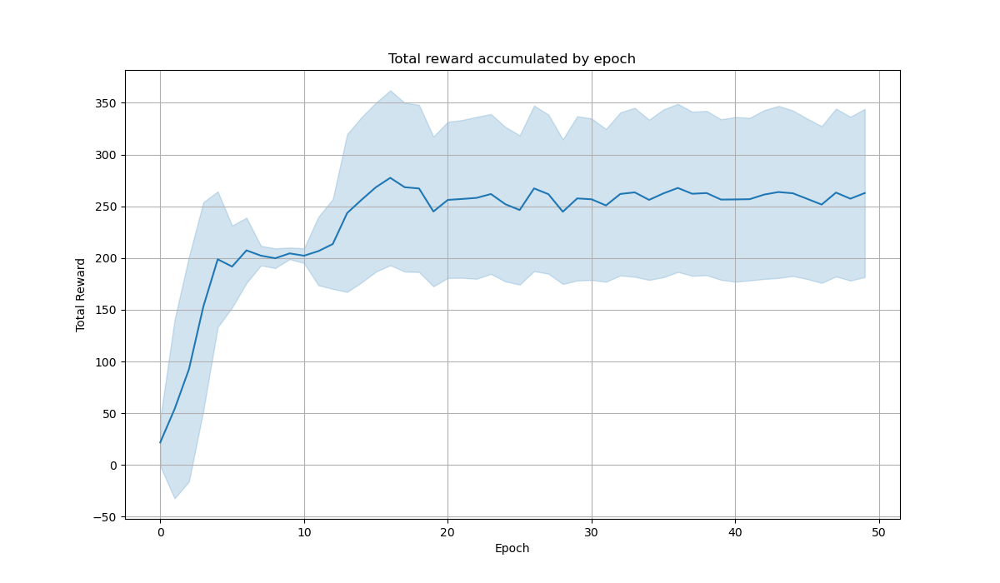
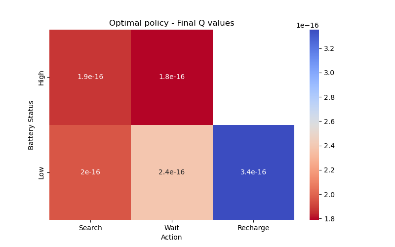

# Report of Project 1 - Reinforcement Learning
## Recycling Robot
### Date: 02/09/2025
### Authors:
 - [**Artur Vidal Krause**](https://github.com/arturvidalkrause)
 - [**Bruno Luís Zerbinatto Rosa**](https://github.com/brunolzrosa)
 - [**Gustavo Luciano dos Santos**](https://github.com/gstavol)

---

## Introduction

### Objective:

The primary goal of this project is to implement and evaluate a Temporal Difference (TD) learning algorithm to determine an optimal operational policy for a simulated recycling robot. The robot's objective is to maximize its total accumulated reward over time, where rewards are granted for collecting recyclable cans. This task is modeled as a continuous reinforcement learning problem.

---

### Problem Description:

The simulation is based on the classic Recycling Robot problem. The robot operates in an environment defined by two states, determined by its battery level: High and Low. In any given state, the robot must decide between a set of actions: search for cans (high reward, high energy cost), wait for cans to be brought to it (low reward, low energy cost), or recharge its battery (no immediate reward, transitions from Low to High state).


## Methodology

### Temporal Difference Algorithm

To implement the algorithm, the robot was trained on epochs, each with 1000 actions. At the end, the robot receives the total reward accumulated in these steps. Then it updates the policy using the TD algorithm and epsilon-greedy as follows:
If the step is exploratory (random), then the weights are not updated.
If it is greedy (exploitation), then we update the q-value in the table using the temporal difference algorithm:


```python
if self.actions:
    last_action_index = len(self.actions) - 1
    
    if self.greedy[last_action_index]:
        last_state = self.states[last_action_index]
        last_action = self.actions[last_action_index]

        td_error_end = total_reward - self.estimations[last_state][last_action]
        self.estimations[last_state][last_action] += self.learning_rate * td_error_end

for i in reversed(range(len(self.actions)-1)):
    if self.greedy[i]:
        current_state = self.states[i]
        current_action = self.actions[i]

        next_state = self.states[i+1]
        next_action = self.actions[i+1]

        immediate_reward = 0
        td_target = immediate_reward + self.gamma * self.estimations[next_state][next_action]
        td_error = td_target - self.estimations[current_state][current_action]

        self.estimations[current_state][current_action] += self.learning_rate * td_error
```

---

### Code structure

We divided the code into 5 main parts, and an auxiliary enum file which contains all the states and actions possible for the robot to take.

The first on is the rewarder. It guarantees that the reward from searching is greater than the reward for waiting.

The second one is the state_updater. It generates the next robot state based on the action taken.

The third one is the recycling. Basicaly, it's the environment that dictates all of the responses to the actions of the robot, and gives the new state to it. It also is responsable for saving all the policies and the total reward in the target files.

The fourth one is the robot. It's the target object that learns to maximize the total reward. It receives the new states from the recycling, and the total reward at the end of each epoch, then update it's policy and continue the simulation.

The last one is the plotter. It's the module that takes the files and plot the results.

All of this is called into the main, in which you can easily change all the parameters.

---

### Chosen Parameters

We choose the parameter in order to have something reasonable. Since it's a continuous problem, the discount must be small, since every action matters. For searching and waiting, we choose small values, such that the penalty for getting out of battery is more important than anything, and searching is reasonably better than waiting. 
The learning rate is set to 0.1 as it's common in RL problems.
The depletion and high to low probabilities are set to 0.3, since in practical problems they usualy are close if not the same.


```python
# Robot Hyperparameters
ALPHA = 0.1
GAMMA = 0.98
EPSILON = 0.1

# Environment parameters
R_SEARCH = 0.5
R_WAIT = 0.2
HIGH_TO_LOW_PROB = 0.3
DEPLETE_PROB = 0.3
```

---

### Results
To obtain a smoother learning curve, we trained the model 30 times, each run consisting of 50 epochs and 1000 steps per epoch. The results shown in the plots are averaged over these 30 independent training runs.

```python
# Simulation parameters
NUM_TRAIN = 30
NUM_EPOCHS = 50
STEPS_PER_EPOCH = 1000
```




With the heatman, we found that the robot prefers to wait if the battery is low, and search if the battery is high, but by a low margin.

Also, we can easily see that the robot learned to maximize the reward by the first graph, in which the total reward is increasing with the training.

---

### Conclusion

In summary, the objective of the project was successfully achieved: the recycling robot learned an effective policy using the Temporal Difference learning. 

The agent demonstrated strategic behavior, prioritizing searching when the battery was high and waiting when it was low, which aligns with long-term reward maximization. 

The results confirm that the TD algorithm, combined with an epsilon-greedy approach, enables the robot to adapt its actions to optimize cumulative rewards in a continuous environment. 

Overall, the project provided valuable insights into reinforcement learning applications and agent decision-making in resource-constrained scenarios.

---